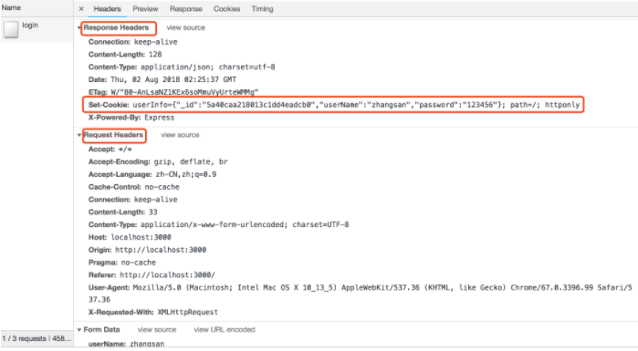
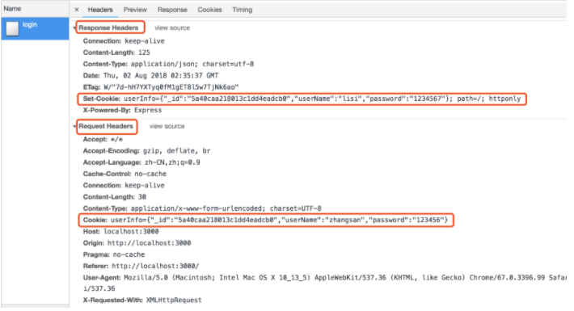

# Cookies and Session

1. Cookie和Session有什么区别？
> 1. Session比Cookie更加安全，因为cookie数据保存在客户端（浏览器），而session数据保存在服务器端，但是服务端的Session的实现对客户端的Cookie有依赖。 
> 2. Cookie不是很安全，别人可以分析存放在本地的Cookie并进行Cookie欺骗，考虑到安全应该用session。 
> 3. Session会在一定时间内保存在服务器上。当访问增多的时候，可以考虑使用Cookie减轻服务器性能。 
> 4. 单个Cookie在客户端的限制是3K，也就是说一个站点在客户端存放的Cookie不能超过3K。 

2. 为什么要用Cookie和Session？

HTTP（超文本传输协议）是一种应用层通信协议，是万维网通信的基础。

但HTTP是无状态协议，通过他不能区别登陆用户。因此需要通行证 -> Cookie。

## 1. Cookie

Cookie是一种客户端保存用户信息的机制，实际上是客户端通过一段文本来记录用户的信息，并随着每次请求发送给服务端。

**Cookie通过请求和响应报文中写入Cookie信息来保存客户端状态。**

Cookie会根据响应报文中Response Headers中的Set-Cookie字段通知客户端保存Cookie。当下次客户端再次向服务端发起请求时，客户端会在请求报文中Request Headers中的Cookie字段加入本地Cookie值发送出去。

当客户端提出保存Cookie的请求后，服务端会在返回报文中的Response Headers中的Set-Cookie字段中返回Cookie信息。

首次登陆，响应头信息中有Set-Cookie参数，但请求头中没有Cookie参数: 

没有清除Cookie的非首次登陆： 

## 2. Session

Session的机制与Cookie类似，当客户端提出保存Session后。服务端会在返回报文的Response Headers中给出Session ID，并保存在Cookie中。

但Session不一定必须依赖Cooike。如果Cookie被禁用或出现问题，PHP会自动把Session附在URL中进行传输。这样通过Session ID就能跨页使用Session变量。

而Session ID就是区分不同用户的唯一ID。