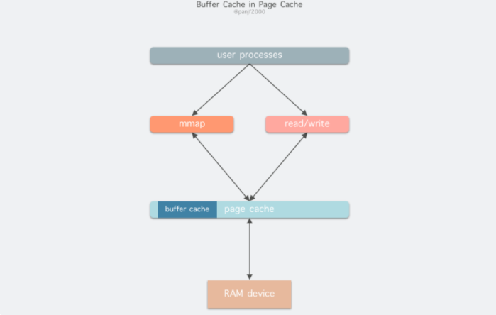

## Coentents

- [I/O缓存](#I/O缓存)
- [I/O模式](#I/O模式)
- [零拷贝](#零拷贝)

## I/O缓存

linux中用户数据传送到磁盘的过程如上图。

read()/wirte()是基本的I/O读写系统调用，在这两个系统调用和真实的磁盘读写之间存在一个Kernel buffer cache（内核缓冲区缓存）；Kernel buffer cache是为了加快读/写。

Kernel buffer cache由Page Cache和Buffer Cache组成。

1. 读磁盘：内核查看Page Cache中是否已经缓存这个数据
> 存在则直接读；不存在则穿透到磁盘中读取，并将数据缓存在Page buffer

2. 写磁盘：内核把数据写入Page Cache，将这一页标记为dirty，将其添加入dirty list
> 定期将dirty list中的页缓存flush到磁盘，保证磁盘和页缓存一致性

Page Cache定期使用页面置换算法（如LRU）淘汰旧页面，且Page Cache是基于虚拟内存的页单元缓存。
> Kernel -> Kernel Buffer Cache -> Disk

Linux 2.4版本后，Page Cache和Buffer Cache进行了统一。

如下图所示，Buffer Cache内嵌入Page Cache中；处理文件I/O缓存交给Page Ceche，底层RAW Device刷新数据时以Buffer Cache的快单位来实际处理。

## I/O模式

linux中的I/O有三种常见模式：**现在常用DMA**

1. 程序控制I/O
2. 中断驱动I/O
3. DMA I/O
> 这三种I/O都需要用到CPU来完成内核空间与用户空间之间的数据复制。

### 程序控制I/O

别称：忙等待/轮询。

user发起系统调用，进入内核态 -> 内核调用对应硬件的驱动程序 -> 驱动程序循环访问硬件，查看数据是否准备好，一般通过返回码来表示 -> I/O结束后，驱动程序将数据copy到指定位置，返回用户态。

### 中断驱动I/O

> CPU共进行两次拷贝

第一步，user发起read()系统调用，陷入内核态并由其所在的CPU通过设备驱动程序向设备寄存器写入一个通知信号，告知设备控制器。

第二步，磁盘控制器把数据从磁盘拷贝到磁盘控制器缓冲区。

第三步，拷贝后，磁盘控制器向中断控制器持续发送中断信号，知道中断信号被受理。

第四步，中断控制器存入此次中断需处理的磁盘编号（device ID）。

第五步，中断控制器向CPU发出中断信号。

第六步，CPU保存现场，把磁盘控制器缓冲区的数据拷贝到内核缓冲区。

第七步，CPU将数据从内核缓冲区拷贝到磁盘缓冲区，完成read()，切回用户态。

### DMA

> CPU共进行一次拷贝，借助DMA完成一次设备间的拷贝

DMA驱动的I/O和中断驱动的I/O不同点：
1. 中断驱动I/O的数据的拷贝都是通过CPU实现的。
2. DMA驱动I/O设备间数据拷贝由DMA实现，内核缓冲区与用户缓冲区的数据拷贝由CPU实现。

### 传统I/O中磁盘读写到网卡的过程

传统I/O从磁盘读取数据到传输到网卡的过程如下图：

4次用户态/内核态的进程上下文切换，2次CPU拷贝，两次DMA拷贝。

## 零拷贝

> 零拷贝是指CPU的零拷贝。

1. 减少甚至避免用户空间和内核空间之间的数据拷贝：通过内核实现数据的拷贝
2. 绕过内核的直接 I/O
3. 内核缓冲区和用户缓冲区之间的传输优化

### 减少甚至避免用户空间和内核空间之间的数据拷贝

mmap()

sendfile()

sendfile() + DMA gather/scatter

splice()：基于linux的管道缓冲区（pipe buffer）机制实现的。

send() + MSG_ZEROCOPY：在10KB左右的大包环境下才会有显著性能提升。

### 绕过内核的直接 I/O

1. 用户直接访问硬件

2. 内核控制访问硬件

### 内核缓冲区和用户缓冲区之间的传输优化

1. 动态重映射与写时拷贝 (Copy-on-Write)

2. 缓冲区共享 (Buffer Sharing)