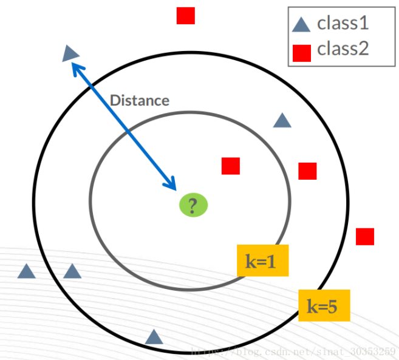
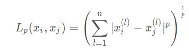

# KNN(K-nearest neighbor)——最邻近算法

KNN：each sample can be represented by its nearest k neighbors.

KNN is classified by measuring the distance between different feature values. 

它的思路是：如果一个样本在特征空间中的k个最相似(即特征空间中最邻近)的样本中的大多数属于某一个类别，则该样本也属于这个类别，其中K通常是不大于20的整数。KNN算法中，所选择的邻居都是已经正确分类的对象。该方法在定类决策上只依据最邻近的一个或者几个样本的类别来决定待分样本所属的类别。

## 1. application scenario

1. 字符识别
2. 文本分类
3. 图像识别

## 2. throty

distance measurement formula: 

If p=1, the Lp is Manhattan distance.

If p=2, the Lp is Eucliden distance.

If p-\>infinity, the Lp is Chebyshev distance.

n means dimension.

## 3. 优点

1. 通过计算对象间距离来作为各个对象之间的非相似性指标，避免了对象之间的匹配问题，在这里距离一般使用Euclidean距离 or Mahattan距离.

2. 依据k个对象中占优的类别进行决策，而不是单一的对象类别决策。

## 4. 缺点

1. Very slow at test timte：训练耗时短，测试耗时长
2. Distance metrics on pixels are not informative：两点间距离公式不能提供足够的信息

维度灾难
> KNN为了能够有效的体现出“最邻近”这个概念，需要样本能够均匀的分布在整个空间中，

## 5. 总结

1. 在图像分类中，通过图像和标签来进行训练，必须在测试集上预测标签。

2. k近邻分类器基于最近距离来对标签进行训练和预测。就是在训练集中数据和标签已知的情况下，输入测试数据，将测试数据的特征与训练集中对应的特征进行相互比较，找到训练集中与之最为相似的前K个数据，则该测试数据对应的类别就是K个数据中出现次数最多的那个分类

3. **距离和K是超参数。**

4. 使用验证集选择超参数；最后只在测试集上运行一次!

5. 交叉验证集的作用是选出效果较好的一组参数在test上进行预测
。
