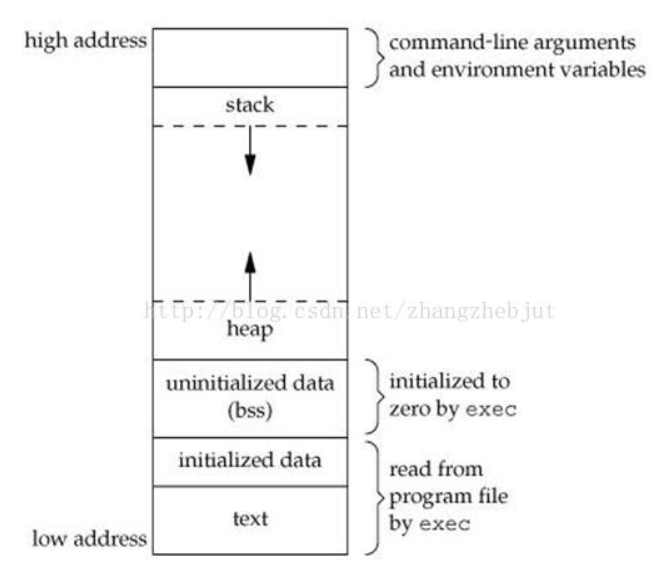

## Coentents

- [进程如何使用内存](#进程如何使用内存)

## 进程如何使用内存

所有的进程都会占用一定数量的内存，而且普通的进程都会涉及到5种数据段。
1. 代码段：存放可执行文件的操作指令，是可执行程序在内存中的镜像。只允许读取，不能写入（修改）。
2. 数据段：存放程序中已初始化的全局变量（static变量和全局变量）。
3. BSS段：存放程序中未初始化的全局变量，在BSS中全部置零。
4. 堆（heap）：存放进程运行中被动态分配的内存段。使用malloc等函数分配内存时，新分配的内存动态的添加到heap上（堆扩张），使用free等函数释放内存时，被释放的内存从heap上剔除（堆缩减）。
5. 栈（stack）：存放程序临时创建的局部变量，也就是函数“{ }”中的变量。函数被调用时，其参数会被压入发起调用的进程栈（压栈）中。调用结束后，函数的返回值也会被压栈，所以stack方便用来保存/恢复现场。



heap向上，stack向下。

```c
#include<stdio.h>
#include<stdlib.h>

int bss_var;
int data_var0 = 1;

int main(int argc, void* args[])
{
    printf("Text location(address): %p\n\n", main);         // Text location(address): 0x4005d6

    printf("Data location(address): %p\n", &data_var0);     // Data location(address): 0x60102c
    static int data_var1 = 1;
    printf("Data location(address): %p\n\n", &data_var1);   // Data location(address): 0x601030

    printf("BSS location(address): %p\n\n", &bss_var);      // BSS location(address): 0x601038

    int stack_var0 = 1;
    int stack_var1 = 1;
    printf("Stack location(address): %p\n", &stack_var0);   // Stack location(address): 0x7ffea6f9eb34
    printf("Stack location(address): %p\n\n", &stack_var1); // Stack location(address): 0x7ffea6f9eb30

    char* heap_var0 = (char *)malloc(sizeof(char));
    printf("Heap location(address): %p\n\n", heap_var0);    // Heap location(address): 0xa286b0

    return 0;
}
         
```