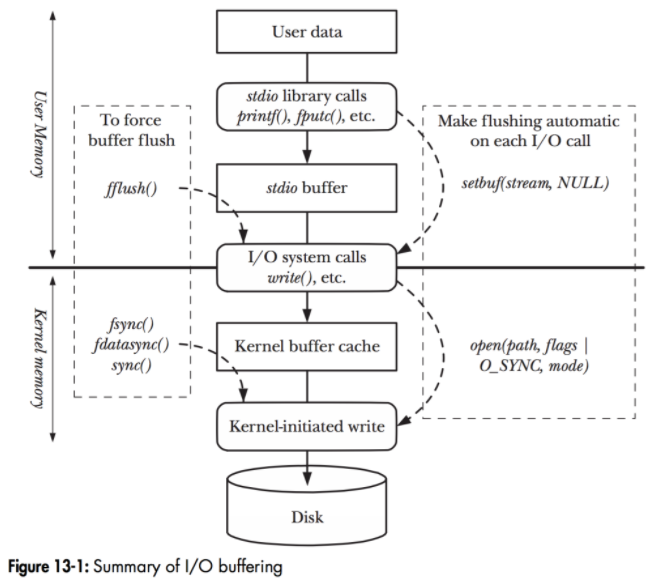

## Coentents

- [进程如何使用内存](#进程如何使用内存)
- [物理内存](#物理内存)
- [虚拟内存](#虚拟内存)
- [Linux I/O](#Linux I/O)

## 进程如何使用内存

所有的进程都会占用一定数量的内存，而且普通的进程都会涉及到5种数据段。
1. 代码段：存放可执行文件的操作指令，是可执行程序在内存中的镜像。只允许读取，不能写入（修改）。
2. 数据段：存放程序中已初始化的全局变量（static变量和全局变量）。
3. BSS段：存放程序中未初始化的全局变量，在BSS中全部置零。
4. 堆（heap）：存放进程运行中被动态分配的内存段。使用malloc等函数分配内存时，新分配的内存动态的添加到heap上（堆扩张），使用free等函数释放内存时，被释放的内存从heap上剔除（堆缩减）。
5. 栈（stack）：存放程序临时创建的局部变量，也就是函数“{ }”中的变量。函数被调用时，其参数会被压入发起调用的进程栈（压栈）中。调用结束后，函数的返回值也会被压栈，所以stack方便用来保存/恢复现场。


heap向上，stack向下。

```c
#include<stdio.h>
#include<stdlib.h>

int bss_var;
int data_var0 = 1;

int main(int argc, void* args[])
{
    printf("Text location(address): %p\n\n", main);         // Text location(address): 0x4005d6

    printf("Data location(address): %p\n", &data_var0);     // Data location(address): 0x60102c
    static int data_var1 = 1;
    printf("Data location(address): %p\n\n", &data_var1);   // Data location(address): 0x601030

    printf("BSS location(address): %p\n\n", &bss_var);      // BSS location(address): 0x601038

    int stack_var0 = 1;
    int stack_var1 = 1;
    printf("Stack location(address): %p\n", &stack_var0);   // Stack location(address): 0x7ffea6f9eb34
    printf("Stack location(address): %p\n\n", &stack_var1); // Stack location(address): 0x7ffea6f9eb30

    char* heap_var0 = (char *)malloc(sizeof(char));
    printf("Heap location(address): %p\n\n", heap_var0);    // Heap location(address): 0xa286b0

    return 0;
} 
```

## 物理内存

物理内存：物理内存其实就是Memory（主存），以内存条的形式嵌在主板的内存槽上。用来加载各种程序和数据，供CPU直接运行和使用。

## 虚拟内存

计算机领域有一句著名哲言————计算机领域的任何问题都可以通过增加一个间接的中间层来解决。

现代物理内存容量的增长速度非常快，但依旧无法匹配Application的需求。因此需要一种技术来解决两者之间的差距。

计算机多程序访问内存经历了以下几个阶段：
1. 直接访问物理内存
2. 静态重定位
3. 动态重定位
4. 交换（SWAPPING）技术
5. 虚拟内存

### 直接访问物理内存
> 段寄存器：为内存的分段管理而设置的。计算机需要对内存分段，以分配给不同的程序使用。

多个程序同时访问一个地址，可能会产生脏数据，甚至可能会引起程序崩溃。

比如A程序在cx寄存器中存入的数据是2，取出来后乘以2放入ax寄存器中的值是4；但B程序在cx寄存器中存入的数据是3，A和B程序并发执行的时候，A从cx寄存器中取出来的值可能是3，最终放入ax寄存器的值就是6。这种情况只是引入了脏数据，如果程序复杂，可能会造成程序崩溃。

在这种情况下需要每一个用户进程都知道其他进程在使用哪些地址，这对于写程序的人来说，可能会导致崩溃。

而操作相对内存地址也是不可取的，因为不同程序共享段寄存器，还是会跳转到同一个位置，造成错误。

### 静态重定位

假设A和B都是16KB的程序，将他们装载入内存后所占的内存地址段分别为0-16348、16348-32768。B的所有相对地址都加16348，即可跳转到正确的内存地址执行正确的指令。静态重定位的缺点是装载程序过慢。

### 动态重定位

后来发展出了存储器的抽象：地址空间（类似于进程是CPU的抽象），每个进程都会分配独享的地址空间。在这一前提下，通过使用动态重定位实现不同进程相同的相对地址指向不同的物理地址。

基本原理：每个CPU配两个特殊硬件Register：基址寄存器、界限寄存器。分别用来存储程序起始物理地址和长度。

访问指定内存地址时，CPU会在将地址发往总线前，将基址寄存器中的值加到该内存地址，同时使用界限寄存器查看地址是否溢出。

动态重定位解决了静态重定位装载程序过慢的问题。虽然比较比较快，但加法运算由于进位传递时间问题，除非使用特殊电路，否则会比较慢。

### 交换（SWAPPING）技术

动态重定位和静态重定位的前提条件是内存非常大，但现实是不可能的。因此发展出了交换技术。

当程序不运行时，将其交换到磁盘上，运行时，再交换到内存中。

进程交换到磁盘，再交换到内存中时，内存布局已经发生了变化。所以在进程换入内存时会通过软件进行内存地址重定位；或者进程在运行期间通过硬件（基址寄存器和界限寄存器）对内存地址进行重定位。


### 虚拟内存

> 当前常用的内存超载技术就是虚拟内存。

核心原理：为每一个进程设置一段“连续“的虚拟地址空间，并将其分为多个具有连续地址的的页（page），将这些page与物理内存做映射。程序执行过程中，如果映射到的物理内存的地址空间已被分配，则执行；若没被分配，则通过”缺页中断“，系统切换到内核态，为虚拟地址分配物理地址，再执行指令。

虚拟地址按固定的大小划分为页（page），物理内存对应的则是页框（page frame）。映射关系通常如下图。


通常page和page frame的大小相同，为4K。

32位架构为每个进程分配4GB虚拟地址空间，64位分配16GB。而实际中当然不可能给所有运行的进程分配4GB物理内存，所以通常使用交换（swap）技术。在进程运行期间，只分配映射当前使用到的内存，暂时用不到的数据则写回磁盘。

进程运行时产生的地址都是虚拟地址，即进程能直接操作的都是虚拟地址。如果没有使用虚拟内存技术，则直接通过总线访问虚拟地址值对应的物理地址，拿到数据；如果采用虚拟内存技术，则该地址的值通过MMU映射之后，再通过总线访问物理地址，拿到数据。

虚拟地址分为虚拟页号（高位部分）和偏移量（低位部分）,通过页表（page table）来实现映射。

page table由页表项构成，页表项中包含页框（page frame）号、修改位、访问位、保护位、Present/absent bit等信息。

下图是一个映射实例：


上述映射过程在MMU中实现。在MMU进行映射转换时，如果Present/absent bit为0，则表示没有映射到真正的物理page frame，引发缺页中断，系统进入内核态。接着系统通过页面置换算法将一个已经存在的物理页面换出（swap），为即将换入的页面腾出空间。


如果要换出页面的页表项的修改位被设置过，则换出这个脏页到磁盘进行更新；如果没有被设置，则直接换入新的页面进行覆盖替换。

## Linux I/O

### I/O缓存



linux中用户数据传送到磁盘的过程如上图。

read()/wirte()是基本的I/O读写系统调用，在这两个系统调用和真实的磁盘读写之间存在一个Kernel buffer cache（内核缓冲区缓存）；Kernel buffer cache是为了加快读/写。

Kernel buffer cache由Page Cache和Buffer Cache组成。

1. 读磁盘：内核查看Page Cache中是否已经缓存这个数据
> 存在则直接读；不存在则穿透到磁盘中读取，并将数据缓存在Page buffer

2. 写磁盘：内核把数据写入Page Cache，将这一页标记为dirty，将其添加入dirty list
> 定期将dirty list中的页缓存flush到磁盘，保证磁盘和页缓存一致性

Page Cache定期使用页面置换算法（如LRU）淘汰旧页面，且Page Cache是基于虚拟内存的页单元缓存。
> Kernel -> Kernel Buffer Cache -> Disk

Linux 2.4版本后，Page Cache和Buffer Cache进行了统一。

如下图所示，Buffer Cache内嵌入Page Cache中；处理文件I/O缓存交给Page Ceche，底层RAW Device刷新数据时以Buffer Cache的快单位来实际处理。


