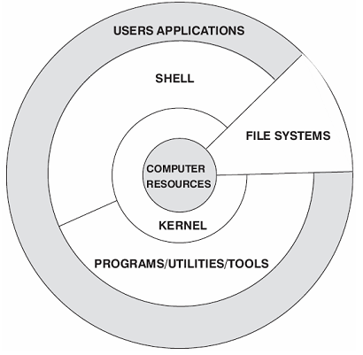
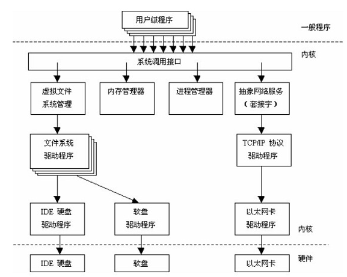
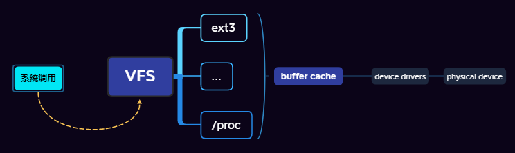

Linux系统一般由4部分构成：kernel、shell、filesystem、application

- [Kernel](#Kernel)
- [FileSystem](#FileSystem)
- [Shell](#Shell)
- [Application](#Application)

## Kernel

内核是操作系统的核心，负责管理系统的进程、内存、设备驱动程序、文件和网络系统。

### 内存管理

当前内存管理使用“虚拟内存”管理。

### 进程管理

Linux通过在短的时间间隔内轮流运行这些进程而实现“多任务”。这一短的时间间隔称为“时间片”，让进程轮流运行的方法称为“进程调度” ，完成调度的程序称为调度程序。

进程调度根据优先级进行调度。

### 文件系统

Linux将独立的文件系统组合成了一个层次化的树形结构，并且由一个单独的实体代表这一文件系统。

Linux支持许多不同的文件系统，并且将它们组织成了一个统一的虚拟文件系统VFS。

VFS：为所有的设备提供了统一的接口.
> 用户和进程不需要知道文件所在的文件系统类型，而只需要象使用 Ext2  文件系统中的文件一样使用它们。

### 设备驱动程序

### 网络接口

提供了对各种网络标准的存取和各种网络硬件的支持。

分为网络协议和网络驱动程序：网络协议部分负责实现每一种可能的网络传输协议。

## FileSystem

除Linux默认文件系统 Ext2、Ext3 和 Ext4 之外，还能支持 fat16、fat32、NTFS（需要重新编译内核）等 Windows 文件系统。

Linux 可以通过挂载的方式使用 Windows 文件系统中的数据。

## Shell

提供了用户与内核进行交互操作的一种接口。

## Application