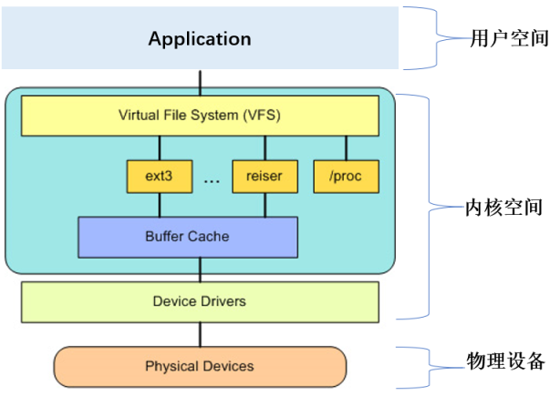
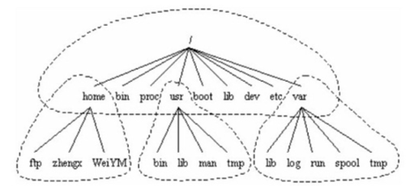

UNIX系统把每个硬件都看成是一个文件(设备文件)，可以用读写文件的方式实现对硬件的访问。

Linux将独立的文件系统组合成了一个层次化的树形结构，并且由一个单独的实体代表这一文件系统。

- [访问文件分层](#访问文件分层)
- [常见文件系统类型](#常见文件系统类型)
- [物理磁盘到文件系统](#物理磁盘到文件系统)
- [文件系统存储原理](#文件系统存储原理)
- [Linux文件结构](#Linux文件结构)

## 访问文件分层

应用程序访问硬盘通过OS提供的API进行。大致分为以下三层：VFS -> device driver -> device

VFS在用户程序和文件系统之间提供一个交换层，方便使用。

文件系统对磁盘访问的性能优化通过页缓存完成，与CPU中的缓存类似。文件系统通过页缓存在数据写/读两方面分别作了优化。

性能优化：
1. 写方面优化：延迟批量写。主要目的是为了增加数据的连续性，规避磁盘机械臂的摆动，因为磁盘机械臂摆动是最耗时的。
2. 读方面优化：预读功能，提前将数据读到内存。由于应用访问数据的区域局部性特点，预读就可以避免应用直接从磁盘读取数据的延时。

### 设备驱动

用于直接驱动硬盘，处于内核空间最下层，为不同的硬盘驱动提供了统一的驱动通用抽象接口。

## 常见文件系统类型

Linux储除了能支持默认的文件系统，还可以通过挂载的方式使用win的数据。

目前最常用的是EXT系列文件系统，不同版本号所支持的最大分区和单个文件的最大大小递增。

## 物理磁盘到文件系统

### 物理磁盘

物理磁盘特点：
1. 硬盘有数个盘片，每盘片两个面，每个面一个磁头。
2. 盘片被划分为多个扇形区域即扇区。
3. 同一盘片不同半径的同心圆为磁道。
4. 不同盘片相同半径构成的圆柱面即柱面。
5. **存储容量＝磁头数×磁道（柱面）数×每道扇区数×每扇区字节数**

### 文件保存至磁盘的步骤

1. 磁盘分区：fdisk /dev/vdb
2. 磁盘格式化：写入文件系统ext4(或其他文件系统) mkfs.ext4 /dev/vdb1; && echo /dev/vdb1  /mnt ext4 defaults 0 0 >> /etc/fstab ; 
3. 磁盘挂载：mount  /dev/vdb1 /mnt
4. 文件保存磁盘/dev/vdb：echo 11 /mnt/123.txt

## 文件系统存储原理

### 文件存储结构

一个磁盘分区在被指定为相应的文件系统后，整个分区被分为 1024，2048 和 4096 字节大小的块。根据块使用的不同，可分为：
1. 超级块(Superblock): 这是整个文件系统的第一块空间，包含文件系统的基本信息。
2. inode块(文件索引节点) : 文件系统索引，记录文件的属性。
3. 数据块(Block) :实际记录文件的内容，若文件太大时，会占用多个 block。

常见两种存储结构：
1. EXT使用的索引式，有inode
2. FAT使用的链式，无inode

### 碎片整理

FAT文件系统中，如果文件太过分散，可能会出现磁盘转几圈才能把所有数据读取出来的情况，通过碎片整理将离散的block整理在一起，提高效能。

EXT文件系统基本不用整理碎片。

## Linux文件结构

Linux使用标准的目录结构，在安装的时候，安装程序就已经为用户创建了文件系统和完整而固定的目录组成形式，并指定了每个目录的作用和其中的文件类型。

Linux只有一个根和树状结构。Win中有几个盘符就有几个并列的根及树状结构。