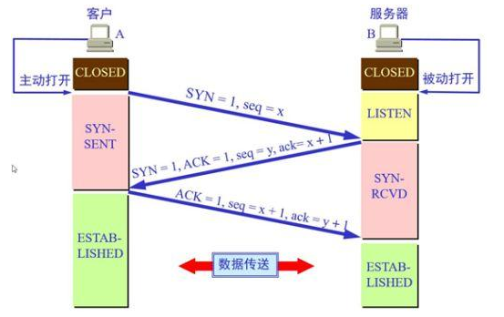
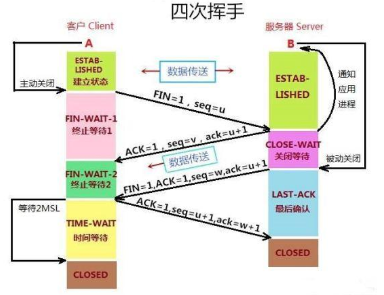

## 1. TCP connection

客户端与服务端数据的发送与返回过程需要创建TCP connection。

TCP不存在连接的概念，只存在请求和响应（数据包）。由TCP创建的一个从客户端发起，服务端接收的类似连接的通道，http请求是在这个连接的基础上发送的。

1. 为什么握手需要三次?
> 1. 建立连接时，在第二次“握手”过程中，服务端发送给客户端的TCP报文是以SYN和ACK作为Flags。SYN是请求连接的Flag，表示服务器同意连接；ACK是确认报文，表示服务器接收到了客户端的报文。
> 2. 第三次握手防止因网络故障造成的服务端无法知晓客户端是否收到第二次握手传输的TCP报文。 
> > 1. 如果客户端没有收到服务端第二次握手的报文，会出现超时重连，即重新发起握手，开启新的端口。 
> > 2. 客户端开启新的端口，此时服务端的端口会出现闲置等待，造成端口浪费。 

2. 为什么挥手需要四次？
> 1. ACK确认报文和FIN释放连接报文分别在二次挥手和三次挥手中发送。

3. 为什么握手三次，挥手四次？
> 1. 握手时，服务端接到连接请求后并不需要进行准备，ACK和SYN在第二次握手时传输，开始建立连接。
> 2. 挥手时，服务端接到释放请求后并需要进行必要的数据处理，所以服务端在第二次挥手发送ACK确认报文，在第三次握手发送FIN释放连接报文。

4. 为什么客户端在TIME-WAIT阶段要等2MSL？
> 1. MSL：Maximum Segment Lifetime，MSL是一个TCP报文在传输过程中最大的生命周期。
> 2. 2MSL是三次挥手FIN报文和四次挥手ACK报文所能生存的最大时间。 
> > 1. 服务端在1MSL内没有收到客户端的ACK确认报文，会再次发动FIN报文。
> > 2. 客户端2MSL内未收到服务端发来的FIN报文，计时器重置，重新发送ACK报文；否则完成四次挥手。

## 2. 三次握手

所谓“三次握手”就是TCP建立连接的过程。这个过程必须是一方主动打开，另一方被动打开。

握手之前，主动连接的客户端结束CLOSED阶段，被打开的服务端结束CLOSED阶段进入LISTEN阶段。

第一次握手：客户端向服务端发送一段TCP报文，其中：
> 1. Flags位为SYN，表示请求加你连接。
> 2. seq=x，x一般为1，seq（序号）用来标记源端到目的端的字节流。
> 3. 客户端进入SYN-SEND阶段。

第二次握手：服务端接收到TCP报文，结束LISTEN，并返回一段TCP报文，其中：
> 1. Flags位为SYN和ACK，表示确认客户端seq，同意建立连接。
> 2. Seq=y。
> 3. ACK=x+1，ACK用于确认客户端Seq有效。使用Seq+1作为自己的确认号
> 4. 进入SYN-RCVD阶段。

第三次握手：客户端接收到从服务端发来的TCP报文，确认数据传输正常，结束SYN-SEND阶段，并返回最后一段TCP报文
> 1. Flags位为ACK，表示确认收到服务端同意连接的信号
> 2. Seq=x+1
> 3. ACK=y+1
> 4. 客户进入ESTABLISHED阶段

服务端在第三次握手后进入ESTABLISHED阶段。

在服务端与客户端传输TCP报文中，双方确认号ACK和Seq都是在彼此的的ACK和Seq基础上运算。
> 优点：保证报文传输连贯性，一旦出现一方报文丢失，无法继续“握手”。

三次握手优点：
1. 防止服务器开启无用连接。
2. 防止已失效连接请求报文段再次传送到服务端。
3. **第三次握手防止因网络故障造成的服务端无法知晓客户端是否收到传输数据。客户端超时重连，打开新的服务端端口，长此以往，会造成服务端端口浪费。**

第三次握手的目的就是客户端告诉服务端是否收到了第二次握手的消息：如果收到，建立连接；否则连接失败，服务器关闭连接端口。

## 3. 四次挥手

所谓四次挥手，即TCP连接的释放。连接的释放必须是一方主动释放，另一方被动释放。

挥手之前主动释放连接的客户端结束ESTABLISHED阶段。随后开始“四次挥手”。

第一次挥手：客户端想要释放连接，向服务端发送一段TCP报文
> 1. 客户端进入FIN-WAIT-1阶段（半关闭阶段），停止向服务端发送数据，但是能从服务端接收数据。
> 2. 不能发送正常连接时传输的数据，但是能发送ASK确认报文。

第二次挥手：服务端接收到客户端发来的TCP报文，结束ESTABLISHED阶段，进入CLOSE-WAIT阶段（半关闭阶段），并返回一段TCP报文：
> 1. 通知应用程序。
> 2. 客户端进入FIN-WAIT-2阶段。

**前两次挥手，让服务端知道客户端想要释放掉连接，并且让客户端直到服务端知道客户端想要释放掉连接。于是，可以关掉连接。**

第三次挥手：服务端向客户端发送ACK确认报文后，经过CLOSE-WAIT阶段，做好释放服务端到客户端的连接准备，再次向客户端发送一段TCP报文：
> 1. 随后服务端结束CLOSE-WAIT阶段，进入LAST-ACK阶段，并停止向客户端发送数据。
> 2. 但客户端仍然能够向服务端发送数据。

第四次挥手：客户端收到从服务端发来的TCP报文，确认服务端已经做好释放的准备，客户端结束FIN-WAIT-2阶段，进入TIME-WAIT阶段，并向服务端发送一段TCP报文：
> 1. 服务端进入CLOSED阶段。
> 2. 客户端等待2MSL，结束TIME-WAIT阶段，进入CLOSED阶段，由此完成“四次挥手”。

**后两次挥手实现关闭连接。**

**与三次握手一样，四次挥手中服务端与客户端之间传输的TCP报文中，ACK和Seq都是基于对方的ACK和Seq进行计算的。一点某方TCP报文丢失，那么挥手就无法进行。**

## 4. TCP中比较重要的字段：

1. 序号（sequence number）：Seq序号，占32位，用来标识从TCP源端到目标端发送的字节流，发起方发送时对此进行标识。

2. 确认号（acknowledgement number）：Ack序号，占32位，只有ACK标志位为1时，确认序号字段才有效，Ack=Seq+1。

3. 标志位（Flags）：共六个
> 1. URG：紧急指针（urgent pointer）有效。
> 2. ACK：确认序号有效。
> 3. PSH：接收方应该尽快将这个报文交给应用层。
> 4. RST：重置连接。
> 5. SYN：发起一个新连接。
> 6. FIN：释放一个连接。
