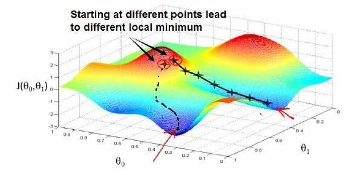
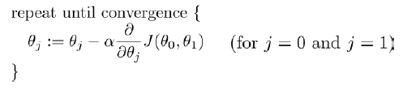
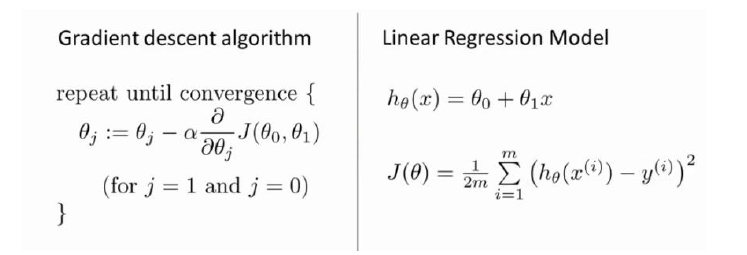
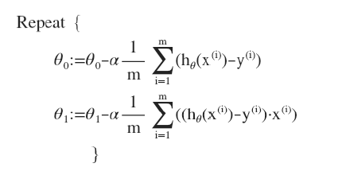

## 监督学习

数据集中每个数据都有正确答案。

回归问题：对连续的数据学习，预测的输出也是连续的。

分类问题：对离散的数据学习，预测的输出也是离散的。

## 无监督学习

数据集没有标签，程序自动分类出不同数据结构的聚集族（聚类算法）。

> 监督学习：垃圾邮件判断（分类问题）、疾病判断（分类问题）、房价预测（回归问题）。

> 无监督学习：新闻事件分类、市场分类。

## 单变量线性回归

只有一个特征x：h(x) = θ1 + θ2 * x

> 其中x代表特征（单变量），θ1和θ2是要训练的参数。

## 损失函数

J(a, b) = 1/2m  * Σ [(h(x) - y(x)) ^ 2]

> 对有m个数据的数据集，求他m个预测数据与实际数据的差值的累加和。 
> 损失函数J最小对应的θ1和θ2的参数为最佳参数。 

## 梯度下降

梯度下降的目标是找到一组参数，使得由这组参数构成的函数与实际数据拟合时误差最小（即损失函数最小）

因为没有尝试所有参数，使用梯度下降找到的损失函数最小值为局部最小值。如上图所示。

对所有参数批量梯度下降的公式如下：

实际应用中θ可能有成千上万个（截至2021.1.14最大的模型时google的Switch Transformer语言模型，有16000亿参数）

公式中的α表示学习率（即下降速率），公式的含义：旧的参数 - （旧参数的斜率 * 学习率）

## 线性回归种的梯度下降

下图分别展示了批量梯度下降算法和线性回归算法。

两个算法融合后的算法如下（已经经过简单的求导处理）：

