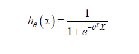
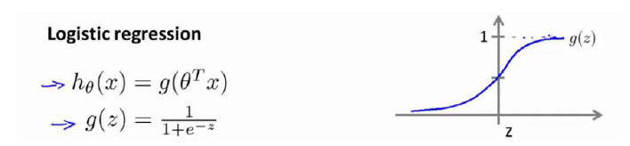
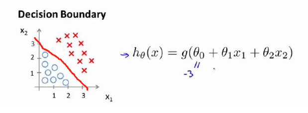
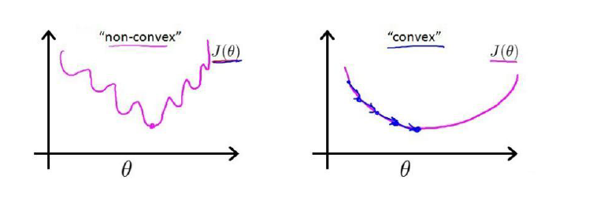
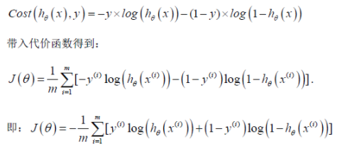
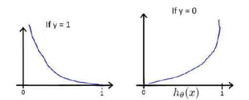
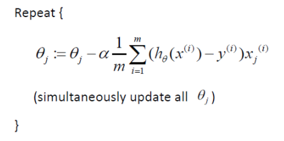
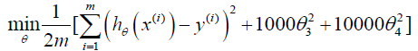
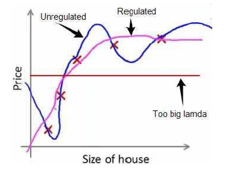

## 逻辑回归

与线性回归的区别：

线性回归：解决线性问题，输出连续的结果。

逻辑回归：解决分类问题，输出离散的结果。

1. 二元分类：输出结果只有两种可能，线性回归无法解决这种问题

2. 假说表示：在逻辑回归中引入如下的公式，该模型的输出总是在(0,1)之间。
> 该模型的输出h表示预测值y=1的概率，h = 0.7表示预测值y=1的概率为70% 
> 当h > 0.5时表示y=1，否则表示y=0 

将上述公式中的 -θ^T * X 转换为z，就能得到下列图像（下图中的g(z)实际上是Sigmoid函数）：

3. 决策边界

在一个Sigmoid函数表达的逻辑回归算法（g(z)）中，如果像要得到预测值y=1，则z应该大于0。

如下图，当θ0 = -3时，使得z=0的这条直线就成为决策边界。

4. 损失函数

逻辑回归算法中的h如果使用和线性回归一样的**误差平方和**，会出现下图左边的非凸函数图像，而我们想要的是右边的函数图像：

逻辑回归中的损失函数不使用**误差平方和**，采用下列新的损失函数的方式（二分类逻辑回归）。

该损失函数中y代表真实数值，h代表预测y=1的概率。

当y=1时，h越大，模型拟合效果越好，损失函数越小；当y=0时，h越小，模型拟合效果越好，损失函数越小。

虽然逻辑回归中使用sigmoid作为预测函数h，但其梯度下降和线性回归形式相同，不同的是h不同。

除了梯度下降算法，寻找最小损失函数的算法还有很多“
> 1. 共轭梯度
> 2. 局部优化法(BFGS)
> 3. 有限内存局部优化发(L-BFGS)

> BFGS和L-BFGS已经被完善的封装了。

和线性回归相同的是使用特征缩放能让梯度下降收敛更快。

## 多分类问题

逻辑回归是二分类问题，多分类可以将其分解为多个2分类问题，训练出多个分类机制，预测数据将每一个分类机制都运行一遍，取最高可能性的输出。

## 正则化

正则化用来解决overfitting。

> 1. L1通过稀疏参数（减少参数数量）降低复杂度。
> 2. L2通过降低参数的值来降低复杂度，同时在梯度下降时加大对θ的惩罚。

正则化不惩罚θ0；L2正则化对θ的惩罚是在代价函数中体现的：

λ又称为正则化参数（regularization parameter），第一个式子中确定θ3和θ4所对应的特征造成了overfiting，对其参数进行惩罚，第二个式子无法确定哪个特征造成正则化，惩罚所有参数。

正则化效果如下图，正则化参数λ如果选择的过大，会把所有参数最小化，导致模型hθ(x)=θ0，也就是上图中红线所示情况，造成欠拟合。

