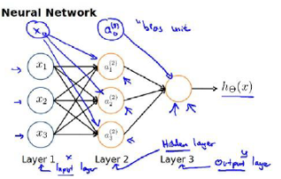
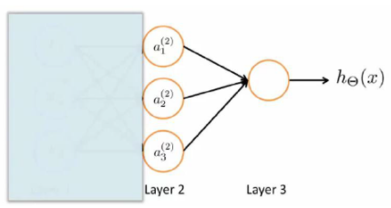
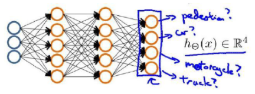
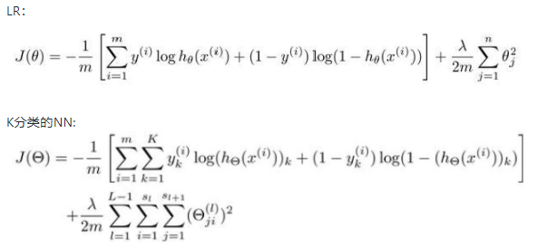
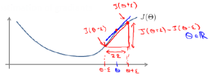
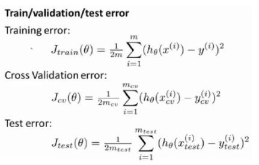
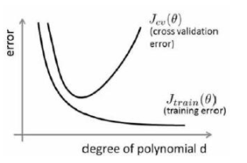
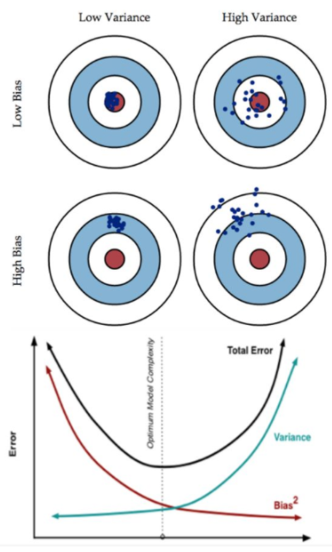

## 神经网络NN模型

神经网络NN分为三层：输入层（input layer）+ 隐藏层（hidden layer） + 输出层（output layer）

NN中除了output layer都有一个bias（偏置）。

下图中的layer2中偏置不由第一层计算得出；其中比较关键参数为weight、activation function、bias。

神经网络与逻辑回归类似，神经网络使用进化后的特征，逻辑回归使用原始特征。

下图中如果只看最后一层hidden layer和output layer，和普通逻辑回归相同。

神经网络与逻辑回归的另一个不同点在于使用神经网络可以如下图同时判断多类别。

神经网络分类：
> 1. 二分类：output layer只有一个神经元，代表1和0
> 2. 多分类：output layer有多个神经元，yi=1

> 疑惑：计算K个损失，也要计算不准确的损失么？

## 反向传播梯度下降

## 梯度检验

对复杂模型使用梯度下降算法，可能会产生一些不易察觉的错误，J可能在减少，但最终结果可能并不是最优解。

使用梯度的数值检验来避免这样的问题，对梯度的估计是沿着切线方向选择离两个非常紧的点然后计算两点的平均值用以估计梯度（二次函数中是斜率）。

## 模型的评估假设（交叉验证cross_validation）

将数据集分为训练集（train）、交叉验证集（cross_validateion）、测试集（test）。

使用train训练出多个模型，使用cross_validation选出交叉验证误差最小的那个模型。

使用交叉误差最小的那个模型对test测试得出推广误差。

上述过程的误差获取方法如下：

## 偏差（bias）和方差（variance）

bias：描述样本拟合出的模型的输出结果与实际结果的差距。

variance：train训练出来的模型在test上的表现

high bias：underfit

high variance：overfit

下图中的横坐标代表上图中上图中最高次幂的大小，也就是说，随着d的增加，特征数量在增加；从下图可以看出，bias和variance呈现负相关

bias和variance共有四种组合方式，如下图所示：

## 学习曲线

bias和variance呈现出负相关的关系，两者分别受到不同的因素影响。

降低bias（underfit）的方法：
1. 增加特征数数量
2. 增大数据集规模
3. 降低正则化λ的大小

降低variance（overfit）的方法：
1. 降低特征数量
2. 减小数据集规模
3. 增大正则化λ的大小