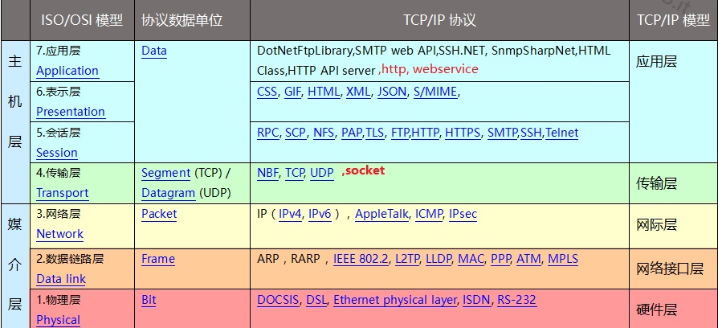

网络协议的作用：
1. 对等层之间的虚拟通信。
2. 层次无关性。

常见网络协议：
1. TCP/IP：Internet网络标准。
2. AppleTalk：Mac OS中采用的网络协议。

- [TCP/IP](#TCP/IP)
- [TCP/IP应用层协议](#TCP/IP应用层协议)
- [TCP/IP传输层协议](#TCP/IP传输层协议)
- [TCP/IP网络层协议](#TCP/IP网络层协议)
- [TCP/IP网络接口层协议](#TCP/IP网络接口层协议)
- [TCP/IP硬件层协议](#TCP/IP硬件层协议)

## TCP/IP

当前TCP/IP的五层协议是基于OSI七层模型而来的。

TCP/IP中共有5层，分别是应用层/传输层/网络层/网络接口层/硬件层。与OSI的对比见下图：

## TCP/IP应用层协议

常用协议：

NET(网络地址转换协议)：内网IP地址和公网地址之间的相互转换。

FTP(文件传输协议)：FTP客户端访问FTP服务端，
> 默认20端口用于传输数据，21端口用于传输控制信息。

HTTP(超文本传输协议)：从WWW服务器传输超文本到本地浏览器。

TELNET：远程登陆服务的标准协议和主要方式。

SMTP(简单邮件传输协议)：控制邮件传输规则以及邮件中转方式。

DNS：定义域名规则，将域名和IP相互映射

## TCP/IP传输层协议

常用协议：

TCP(传输控制协议)：用于网间传输的协议，分割处理报文并把结果包传到IP层，并接收处理来自IP层的数据包。

UDP(用户数据协议)：用于需要在计算器之间传输数据的应用，将网络数据流浪压缩成数据包。

## TCP/IP网络层协议

常用协议：

ip(网络互连协议)：将多个包在网络中联系起来，传输数据包（不可靠传输），最基本功能就是寻址和分段功能，不提供端到端，路由到路由的确认，不提供重发和流量控制。出错则向ICMP报告，ICMP在IP模块中实现

ICMP：面向无连接协议，用于传输错误报告控制信息（控制信息是指网络不通畅，主机是否到达，路由是否可用的这些网络本身的消息，不涉及用户传输的数据）

ARP(地址解析协议)：根据IP地址获取物理地址的协议（即MAC地址）。在同一子网内通过ARP协议可以实现数据包的互相传递。不在一个子网内则无法获得MAC地址，只有通过网关去处理。

RARP(反转地址协议)：和ARP协议相反，将主机的物理地址转换成IP地址。

BOOTP(引导程序协议)：用于无盘工作站的局域网中，可以无盘工作站从一个中心服务器上获得IP地址。

## TCP/IP网络接口层协议

## TCP/IP硬件层协议